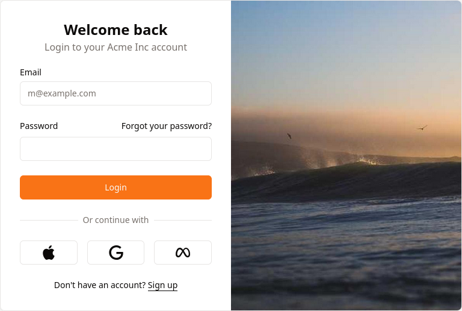

# esbuild-shadcn-svelte

Starter kit to build
[Shadcn](https://www.shadcn-svelte.com/)-[Svelte](https://svelte.dev/) apps with
[esbuild](https://esbuild.github.io/).



## Install

```bash
pnpm install # or npm
```

## Developpement

```bash
pnpm run dev
```

Open your browser to <http://127.0.0.1:8080>.

### shadcn-svelte

To add new components run e.g.:

```bash
pnpm dlx shadcn-svelte@latest add card
```

## Build for production

```bash
pnpm run build
```

Deploy the `public/` directory.
